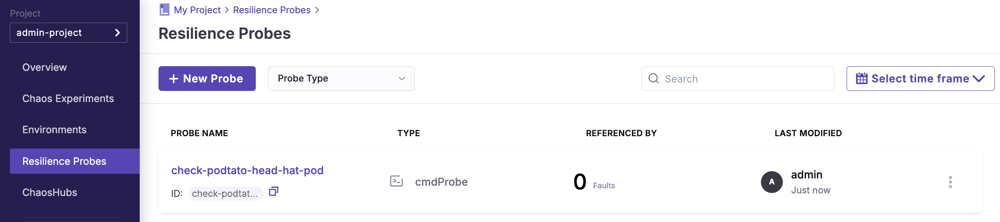

---


In this tutorial, we will inject a pod-delete fault into a sample microservices application called [podtato-head](https://github.com/cncf/podtato-head) and verify if the service continues to be available during the chaos duration.

## Prerequisites

- Kubernetes 1.18 or later (minimum 2 vCPUs, 8GB RAM, 10GB disk space)

- A Persistent volume of 20GB

- [Helm3](https://v3.helm.sh/) or [kubectl](https://kubernetes.io/docs/tasks/tools/#kubectl)

## Install ChaosCenter

1. Follow the [Getting-started](../getting-started/installation.md) to install ChaosCenter

2. Access to ChaosCenter Dashboard


## Set up Environment
1. Add a new environment
- Environment Name: `local`
- Environment Type: `Production`


## Enable Chaos Infrastructure

1. Configure a new chaos infrastructure
- Name: `local`
- Chaos Components Installation: `Cluster-wide access`
- Installation Location (Namespace): `litmus`
- Service Account Name: `litmus`

2. Deploy the new chaos infrastructure

```bash
kubectl apply -f local-litmus-chaos-enable.yml
```

3. Wait until the status shows `CONNECTED`.


## Set up Resilience Probe
1. Select probe type as HTTP Probe

2. Configure properties & probe details
- Name: `check-podtato-main-access-url`
- Timeout: `1s`
- Interval: `100ms`
- Attempt: `1`
- URL: `http://podtato-main.{{workflow.parameters.adminModeNamespace}}.svc.cluster.local:9000`
- Method: `Get`
- Criteria: `==`
- Response Code: `200`



## Run Chaos Experiment with Podtato-head
1. For Kubernetes v1.24 or later, bind a ClusterRole to the `argo-chaos` service account 

```bash
kubectl create rolebinding argo-chaos-binding --clusterrole=admin --serviceaccount=litmus:argo-chaos -n litmus
```

2. Configure a new chaos experiment
- Name: `podtato-head`
- Chaos Infrastructure: `local`

3. Select **Podtato-head Chaos** template 


4. Add probe to `pod-delete` fault
- Probe Name: `check-podtato-main-access-url`
- Mode: `Continuous`


5. Save and run the chaos experiment

## Check Chaos Experiment Results

- Experiment Status: `COMPLETED`
- Resilience Score: `100%`
- Probe Result: `PASSED`


---

Great job! You've successfully completed this tutorial.   
Ready for more? Explore additional tutorials and continue your exciting journey with LitmusChaos! 🚀
